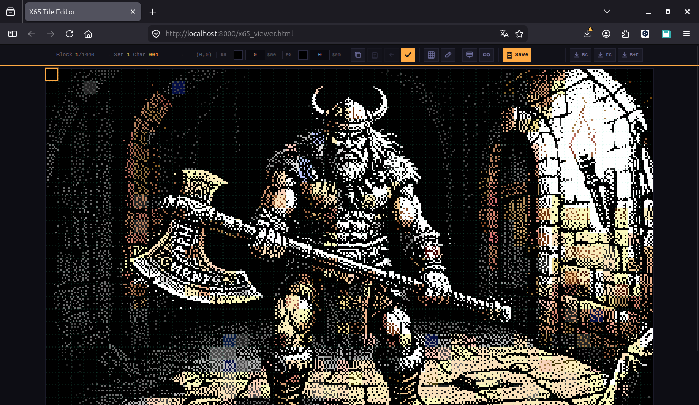

# X65 Image Converter & Tile Editor



> **A collaborative AI experiment** — built with KIMI, Deepseek, Claude, Gemini, and GPT.
> Converts modern images into the native graphics format of the [**X65 retro computer**](https://x65.zone/).

---

## Overview

This tool transforms standard PNG images into the X65's native display format:

- **Resolution:** 384 × 240 pixels
- **Tile grid:** 8 × 8 pixels (48 × 30 tiles = 1,440 total)
- **Palette:** 256 colors (RGB), configurable via PNG or JSON
- **Display mode:** Hi-res — 1 bit per pixel inside each tile, with per-tile foreground/background color attributes

In addition to batch conversion, the package includes a **self-contained web-based tile editor** with live preview, undo, palette picking, and CRT emulation — all served locally over HTTP.

---

## Features

### Image Conversion
- **Lanczos resampling** to 384×240
- **Color/contrast enhancement** (configurable weights)
- **Per-tile color analysis** — extracts optimal foreground & background indices from each 8×8 block using luminance-weighted distance
- **Hi-res mask generation** — 1-bit threshold mask for bit-plane rendering
- **Palette matching** — weighted Euclidean distance in RGB space
- **Batch export** of binary tilesets, color maps, linear bitmaps, and PNG previews

### Web Tile Editor (`--serve` / `--edit`)
- **Live canvas preview** with pixel-perfect scaling
- **Per-tile color editing** — click any tile to change its BG/FG palette indices
- **Palette picker** — 32×8 grid with hover tooltips (RGB values + hex)
- **Undo stack** (up to 20 steps)
- **Copy / paste** tile color attributes
- **Visual aids:** tile grid overlay, modified-tile highlighting
- **CRT emulation** — scanlines, aperture grille, vignetting via CSS
- **Smoothing toggle** — sharp pixels vs. interpolated preview
- **Atomic save** — transactional file replacement via `tempfile` + `os.replace()`
- **Cache-busting** — automatic timestamp invalidation after save

---

## Architecture

```
converter_x65/
├── config.py              # Frozen dataclass with all X65 constants
├── palette.py             # Palette loader (PNG / JSON) + closest-color matcher
├── image_processing.py    # Core converter: prepare → analyze → encode
├── tile_encoder.py        # Bit-level tile/row encoder + pixel accessor protocol
├── output_generator.py    # Exports all binary/PNG/JSON/HTML artifacts
├── html_template.py       # Self-contained web editor (single-file HTML/JS/CSS)
├── server.py              # Threaded HTTP server with POST /save handler
└── __main__.py            # CLI entry point
build.py                   # Zipapp builder (produces converter_x65.pyz)
```

### Key Design Decisions
- **Protocol-based pixel access** (`PixelAccessor`) decouples the encoder from image sources — the same `TileEncoder` works with PIL masks, numpy arrays, or custom accessors.
- **Centralized config** (`X65Config`) guarantees consistent dimensions across Python backend and JavaScript frontend.
- **Transactional saves** in the server ensure the filesystem is never left in a half-written state.
- **Vectorized simulation regeneration** (`numpy` + `PIL`) recomputes the preview image in milliseconds after every save.

---

## Algorithms

### Luminance & Color Extraction
For each 8×8 tile:
1. Compute per-pixel luminance: `Y = 0.299·R + 0.587·G + 0.114·B`
2. Select the **darkest** pixel as background, **brightest** as foreground
3. Map both to the nearest palette entry using **luminance-weighted Euclidean distance**:

```
distance² = w_r·(ΔR)² + w_g·(ΔG)² + w_b·(ΔB)²
```

### Hi-Res Mask
The source image is converted to grayscale and thresholded at 128 (configurable) to produce a 1-bit mask.
Each tile is encoded as **8 bytes** (1 byte per row, MSB = leftmost pixel).

### Palette Formats
- **PNG:** 16×16 color grid (samples the center of each cell)
- **JSON:** flat list of 256 `[R,G,B]` triplets, or 32 rows × 8 columns

---

## Requirements

- **Python** 3.9+
- **Pillow** ≥ 10.0.0
- **NumPy** ≥ 1.24.0

```bash
pip install pillow numpy
```

---

## Installation

### Option A: Run as a module (development)
```bash
git clone <repo>
cd x65-hires-converter
python -m converter_x65 image.png --serve
```

### Option B: Build a standalone `.pyz` (distribution)
```bash
python build.py
# Produces: converter_x65.pyz
python3 converter_x65.pyz image.png --serve
```

---

## Usage

### Convert an image
```bash
python -m converter_x65 image.png
```
Auto-detects palette in this order:
1. `X65-palette_32x8_rgb.json`
2. `x65_palette.json`
3. `X65_RGB_palette.png`

### Convert + launch web editor
```bash
python -m converter_x65 image.png --serve
```

### Launch editor for existing files
```bash
python -m converter_x65 --edit
```

### Verify output consistency
```bash
python -m converter_x65 --verify
```

### Custom palette
```bash
python -m converter_x65 image.png --palette my_palette.json
```

---

## Output Files

| File | Description |
|------|-------------|
| `x65_background.map` | 1,440 bytes — BG color index per tile |
| `x65_foreground.map` | 1,440 bytes — FG color index per tile |
| `x65_maps_split.bin` | 2,880 bytes — concatenated BG + FG |
| `x65_tileset_0.bin` … `x65_tileset_5.bin` | 6 sets × 240 tiles × 8 bytes |
| `x65_hires_linear.bin` | 11,520 bytes — linear 1-bit bitmap |
| `x65_hires_ultra.png` | 1-bit reference mask (PNG) |
| `x65_simulation_ultra.png` | RGB simulation of final X65 output |
| `x65_palette.json` | 256-entry RGB palette |
| `x65_viewer.html` | Standalone web editor |

---

## Web Editor Controls

| Action | Control |
|--------|---------|
| Select tile | Click on canvas |
| Change colors | Click BG/FG swatch → pick from palette |
| Apply changes | ✓ button or `Enter` |
| Undo | ↶ button or `Z` |
| Copy attributes | ⧉ button or `C` |
| Paste attributes | ⧉ button or `V` |
| Toggle grid | Grid button |
| Highlight modified | Pencil button |
| CRT effect | CRT button |
| Toggle smoothing | Sharp/Smooth button |
| Save to disk | 💾 Save button (atomic, server-side) |
| Download maps | BG / FG / B+F buttons |

---

## Credits

This project was created through iterative collaboration between multiple large language models:

- **KIMI** (Moonshot AI)
- **Deepseek**
- **Claude** (Anthropic)
- **Gemini** (Google)
- **GPT** (OpenAI)

Each model contributed to different layers — from low-level bit-encoding protocols and vectorized numpy pipelines to the CRT-shaded web UI and transactional file I/O.

Target platform: [**X65 by Tomasz [smokku] Sterna**](https://x65.zone/) — a modern 8-bit retro computer.

---

## License

MIT — feel free to fork, hack, and port. If you improve the dithering or add animation support, send a PR!
